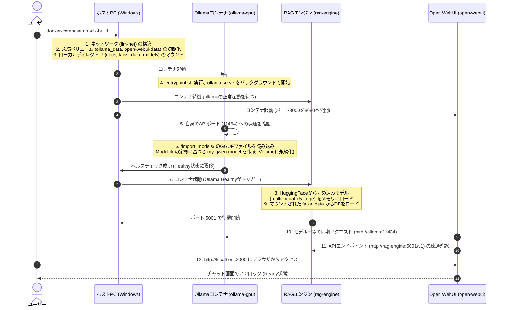

# my-llm-project

このプロジェクトは、ローカル環境で動作するLLM（大規模言語モデル）のチャットアプリケーションと、RAG（Retrieval Augmented Generation：検索拡張生成）機能を組み合わせたシステムです。

## 概要

本システムは以下の3つのコンポーネントで構成されています。すべてDocker上で動作するため、ホストPC環境を汚さずに構築可能です。

1. **Ollama**: ローカルLLMサーバー（モデル：`Qwen2.5-3B-Instruct`）
2. **Open WebUI**: ChatGPTライクな高機能Webインターフェース
3. **RAG Engine**: 独自の文書をベクトルデータベース（FAISS）から検索し、LLMに回答させるFastAPIサーバー

---

## ⚠️ 初回構築時の重要なお知らせ（必ずお読みください）

このシステムはローカルでAIを動かす性質上、**初回のセットアップに非常に時間がかかります。**
途中で止まっているように見えても、裏でダウンロードやコピーが進行していることが多いため、気長にお待ちください。

* **モデルファイルのダウンロード（約2.2GB）**: 回線速度に依存しますが、数分〜数十分かかる場合があります。
* **RAGエンジンの初回ビルド（約3~5GB）**: PyTorchやCUDAなどの巨大なライブラリをダウンロード・インストールするため、**10分〜30分程度**かかります（PCスペックと回線に依存）。
* **AIモデルのDocker内への展開（数分）**: Docker for Windowsの仕様上、Windows側のフォルダにある2.2GBのモデルファイルをDocker内部の専用領域にコピーする処理が行われます。この処理中はチャットが応答しません。**進捗は `docker logs ollama-gpu -f` コマンドで確認でき、100%になるまで数分〜十分ほどお待ちいただく必要があります。（初回のみ）**

---

## 💻 前提条件（必須環境）

このシステムを動かすには、以下のソフトウェアとハードウェアが必要です。

* **OS**: Windows (WSL2環境推奨), macOS, Linux
* **GPU**: NVIDIA GPU (VRAM 6GB以上を強く推奨)
* **ソフトウェア**:
  * [Docker Desktop](https://www.docker.com/products/docker-desktop) または Docker Engine がインストールされ、起動していること
  * Dockerの `NVIDIA Container Toolkit` が設定済みであること（GPUを使用する場合）
  * `git` コマンドが使用可能なこと

---

## 🔍 ローカルLLMの選定とスペック確認

## 🔍 ローカルLLMの選定とスペック確認（Windows）

ローカル環境でLLMを快適に動作させるためには、マシンのスペック（特にGPUのVRAM容量）に適したモデルを選択することが極めて重要です。
ここでは、Windowsホスト側とDockerコンテナ側のリソース確認コマンド、およびリソース割り当ての目安を整理します。

### 1. ホスト側 (Windows) と Dockerコンテナ側のスペック確認コマンド一覧

ホスト側（PowerShell）と Dockerコンテナ側それぞれで、リソースがどのように認識されているかを以下のコマンドで確認し、比較することができます。

#### 💻 CPUの確認
* **ホスト側 (Windows / PowerShell)**:
  ```powershell
  Get-CimInstance Win32_Processor | Select-Object Name, NumberOfCores, NumberOfLogicalProcessors
  ```
  *(出力例: 物理コア数 `NumberOfCores` と 論理プロセッサ数 `NumberOfLogicalProcessors` が確認できます)*
* **Docker側 (コンテナ内)**:
  ```bash
  docker run --rm alpine nproc
  ```
  *(出力例: Dockerコンテナに割り当てられている論理プロセッサ数が表示されます。ホスト側より極端に少ない場合は割り当て設定を見直してください)*

#### 🧠 メモリ (RAM) の確認
* **ホスト側 (Windows / PowerShell)**:
  ```powershell
  Get-CimInstance Win32_PhysicalMemory | Measure-Object -Property Capacity -Sum | ForEach-Object { [Math]::Round($_.Sum / 1GB, 2) }
  ```
  *(出力例: 物理メモリの総量（GB単位、例: `32`）が表示されます)*
* **Docker側 (コンテナ内)**:
  ```bash
  docker run --rm alpine free -m
  ```
  *(出力例: Dockerコンテナが利用可能なメモリ総量が MB 単位で表示されます)*
  > **注意**: WindowsのWSL2環境では、デフォルトでホストメモリの50%（または最大8GB）程度に制限されていることがあります。制限を変更するには、ホームディレクトリ直下の `.wslconfig` ファイル（例: `C:\Users\<ユーザー名>\.wslconfig`）を作成・編集してください。

#### 🎮 GPU / VRAM の確認
* **ホスト側 (Windows / PowerShell)**:
  ```powershell
  nvidia-smi
  ```
  *(出力例: 搭載されているNVIDIA製GPUの型番と、VRAMの総容量（例: `12288MiB`）が表示されます)*
* **Docker側 (コンテナ内)**:
  システム起動前に確認する場合は以下のテストコマンドを実行します。
  ```bash
  docker run --rm --gpus all nvidia/cuda:12.0.0-base-ubuntu22.04 nvidia-smi
  ```
  システムが起動している（`docker-compose up -d` 実行後）場合は、以下で確認できます。
  ```bash
  docker exec -it ollama-gpu nvidia-smi
  ```
  *(出力例: ホスト側と同様にGPU型番やVRAM容量が表示されれば、Dockerコンテナ内からGPUが正常に認識されています)*

---

### 2. 妥当なリソース割り当ての目安

本プロジェクト（LLM + RAGエンジン + WebUI）を安定して動かすための、Docker（WSL2）への推奨割り当ては以下の通りです。

| リソース | GPUを使用する場合（推奨） | CPUのみで動作させる場合 |
| :--- | :--- | :--- |
| **メモリ (RAM)** | **8 GB 以上** （推奨: **12 GB 以上**）<br>※ RAGエンジンの埋め込みモデル（Embedding）のロードやWebUIの動作で約4GB程度消費します。 | **16 GB 以上**<br>※ LLMモデル（約5.5GB）とRAGエンジン（約4GB）が両方ともメインメモリ上に展開されるため、12GB以下ではメモリ不足（OOM）でコンテナがクラッシュします。 |
| **CPUコア数** | ホストCPUの論理プロセッサ数の **半分〜75%** （例: 16スレッドなら **4〜6コア** 程度） | 同左。割り当てが少なすぎると（例: 2コア以下）、RAGの検索やCPU推論の速度が極端に低下します。 |

---

### 3. スペックに応じたローカルLLM（モデル）の選定目安

ローカルLLMを実用的な速度（1秒間に生成される文字数）で動作させるには、**「モデルのファイルサイズ ≒ 動作に必要なVRAM容量」が、搭載されている専用GPUメモリ（VRAM）内にすべて収まること** が大原則となります。

| 搭載VRAM容量 | 推奨されるモデルサイズ（パラメーター数）の目安 | 本プロジェクトでの対応 |
| :--- | :--- | :--- |
| **6GB以下** | **1B 〜 3B** クラス（超軽量モデル）<br>（例: `Llama-3-8B` 等の動作は非常に厳しく、CPU/メモリへの退避が発生し極端に低速になります） | 本プロジェクト推奨の `Qwen2.5-3B-Instruct` (Q4_K_M: 約2.2GB) は、6GBのVRAM内に完全に収まり、非常に快適かつ高速に動作します。 |
| **8GB** | **7B 〜 9B** クラス（軽量・実用モデルの4bit/8bit量子化版）<br>（例: `Llama-3-8B` や `Gemma-2-9B` のQ4量子化モデル） | 本プロジェクトの標準モデルが最も快適かつ安定して動作する推奨ラインです。 |
| **12GB** | **8B 〜 14B** クラス<br>（例: `Qwen-2.5-14B` や `Llama-3-8B` の高精度量子化版） | 8Bクラスのモデルが非常に余裕を持って動作します。また、少し大きめの14Bクラスのモデルも選択肢に入ります。 |
| **16GB以上** | **14B 〜 32B** クラス<br>（例: `Command-R` や `Qwen-2.5-32B` などの高性能モデル） | ローカルでも非常に精度の高い推論処理を行うことが可能です。 |

> [!TIP]
> **VRAMが不足した場合の挙動について**
> OllamaはVRAMが不足すると、自動的に処理の一部（レイヤー）をCPUとメインメモリ（RAM）に逃がして実行（フォールバック）します。これにより動作自体はしますが、VRAMだけで処理する場合と比較して **生成速度が10倍〜数十倍遅く** なります。チャットの応答が遅いと感じる場合は、ワンサイズ小さいモデルへの変更をご検討ください。

> [!TIP]
> **マシンスペックに応じた動作可能モデルの計算と調べ方**
> 特定のモデルが自分のPCで動作するか確認したい場合、以下の簡易計算式やオンラインの判定ツールが役立ちます。
> 
> **1. 必要メモリ（VRAM/RAM）の簡易計算式（目安）**
> $$\text{必要メモリ (GB)} \ge \frac{\text{パラメータ数 (B)} \times \text{量子化ビット数}}{8} \times 1.4$$
> * ※末尾の `1.4` は、対話時のコンテキスト（履歴）の保持領域（KVキャッシュ）や、推論エンジンのオーバーヘッドを加味した安全係数です。
> * **例: 8B (80億) パラメータのQ4量子化（4-bit）モデルを動かす場合**:
>   $$(8 \times 4 / 8) \times 1.4 = 5.6 \text{ GB}$$
>   この場合、VRAMが6GB以上あればほぼ確実にVRAM単体で高速処理できることが事前に分かります。
> 
> **2. オンラインVRAM計算・対応判定ツール**
> * **[Can You Run This LLM?](https://apxml.com/tools/vram-calculator)**: モデルのパラメータ数、量子化設定、コンテキスト長、GPUの種類を入力するだけで動作可能性をグラフィカルに判定してくれます。
> * **[Onyx AI GPU & VRAM Model Checker](https://onyx-ai.com)**: お使いのGPU型番から、互換性のある（VRAM内に収まる）モデル候補を自動でリストアップしてくれます。
> * **[LLM VRAM Estimator](https://smcleod.net)**: GGUF形式等のメモリ占有率をシンプルに計算できるエスティメーターです。

---

## 🚀 セットアップ手順（初心者向け完全ガイド）

### Step 1: リポジトリのクローンと移動

ターミナル（Windowsの場合はPowerShellやコマンドプロンプト）を開き、以下のコマンドを実行します。

```bash
# プロジェクトをダウンロード
git clone <このリポジトリのURL>
# フォルダへ移動
cd my-llm-project
```

### Step 2: LLMモデルファイルのダウンロードと配置

AIの「脳」となるモデルファイル（約2.2GB）をダウンロードします。

1. 以下のHugging Faceのファイル一覧ページにブラウザでアクセスします。
   ▶ [Hugging Face: Qwen/Qwen2.5-3B-Instruct-GGUF (main)](https://huggingface.co/Qwen/Qwen2.5-3B-Instruct-GGUF/tree/main)
2. ファイル一覧から `qwen2.5-3b-instruct-q4_k_m.gguf` を探し、行の右側にあるダウンロードボタン（↓矢印アイコン）をクリックして手動でダウンロードしてください。
   （※または、以下のcurlコマンド等を使って直接ダウンロードすることも可能です）
   ```bash
   curl -L -o ollama/models/qwen2.5-3b-instruct-q4_k_m.gguf https://huggingface.co/Qwen/Qwen2.5-3B-Instruct-GGUF/resolve/main/qwen2.5-3b-instruct-q4_k_m.gguf
   ```
3. ダウンロードしたファイルが、このプロジェクト内の `ollama/models/` フォルダの中に配置されていることを確認します。

> **完了確認**: `my-llm-project/ollama/models/qwen2.5-3b-instruct-q4_k_m.gguf` という配置になっていればOKです。

### Step 3: Dockerサービスの起動

すべての準備が整ったら、システムを起動します。

```bash
docker-compose up -d --build
```

**【重要】このコマンドを実行した後の待ち時間について**
* コマンド実行直後から、RAGエンジンの環境構築（PyTorchなどの巨大なファイルのダウンロード）が始まります。
* **ターミナルの文字の動きが止まっても、エラーが出ていなければ（赤字等で止まらなければ）そのまま10〜30分ほど放置してください。**
* `Container open-webui Started` のようなメッセージが出れば起動完了です。

### Step 4: アプリケーションへのアクセス

ブラウザを開き、以下のURLにアクセスしてください。

▶ **[http://localhost:3000](http://localhost:3000)**

* 初回アクセス時に、管理者のアカウント作成（サインアップ）画面が表示される場合があります。お好きなメールアドレスとパスワードで登録してください（ローカル環境なので外部には送信されません）。
* 画面上部にあるモデル選択のプルダウンから、用途に合わせて以下のいずれかのモデルを選択してチャットを開始できます。
  * **`my-local-model`**: RAG機能（社内知識の検索）が有効になったAIモデルです。自社データに基づく回答が必要な場合はこちらを選択してください。
  * **`my-qwen-model:latest`**: RAG機能を通さない、純粋なLLM（AIの生身）です。一般的な会話やプログラミングの質問などはこちらが適しています。

---

## 🛠 トラブルシューティング（よくあるエラーと解決法）

### Q1. `$'\r': command not found` または `exec /entrypoint.sh: no such file or directory` というエラーが出てOllamaが起動しない（Windowsの方）

**原因**: WindowsでGitクローンした際、ファイルの改行コードが「CRLF」に変換されてしまい、LinuxベースのDockerコンテナがスクリプトを実行できなくなっているためです。
**解決法**: `ollama/entrypoint.sh` ファイルをVSCodeなどのエディタで開き、右下の改行コードを「CRLF」から「LF」に変更して上書き保存してください。その後、`docker-compose up -d --build` を再度実行します。
（※現在はこの問題を自動で防ぐための `.gitattributes` ファイルを追加済みです）

### Q2.ポートが既に使用されている（`port is already allocated`）と言われる

**原因**: 過去に起動した別のDockerコンテナ（Difyなど）が同じポート（3000 や 5001）を使用しているためです。
**解決法**: ポートを使用しているコンテナを停止してください。
```bash
# 稼働中のコンテナ一覧を確認
docker ps
# 該当のコンテナを停止（例：dify-webというコンテナの場合）
docker stop dify-web
# 当システムを再起動
docker-compose up -d
```

### Q3. チャット画面は開けるが、いつまで待ってもAIが返答しない（考え中から進まない）

**原因**: 初回構築時、5.5GBの巨大なAIモデルをWindows側からDockerの内部ストレージ（Volume）へコピーする作業が裏で進行中です。このコピーが完了するまではAIは応答できません。
**解決法**: 別のターミナル（PowerShell等）を開き、以下のいずれかのコマンドを実行して状況を確認してください。

**① 進捗をリアルタイムで見守る場合**:
```bash
docker logs ollama-gpu -f
```
`copying file sha256:... 15%` のようなログが流れていれば正常です。これが `100%` になり `Model created successfully!` と表示されるまで放置してください（PCスペックにより数分〜十分程度かかります）。

**② コピーが完了したか一瞬で確認する場合**:
```bash
docker exec ollama-gpu ollama list
```
実行結果に `my-qwen-model:latest` と表示されれば、コピー処理は完全に終わっておりAIの準備は完了しています。（何も表示されない場合はまだ裏で処理中です）

### Q4. 「モデルが見つかりません」またはAIが返答しない（上記Q3ではない場合）

**原因**: ステップ2のモデルファイル配置場所が間違っているか、ファイル名が完全に一致していない可能性があります。
**解決法**: `ollama/models/` の中に `qwen2.5-3b-instruct-q4_k_m.gguf` という名前でファイルが保存されているか、拡張子が `.gguf.txt` などになっていないか確認してください。

### Q5. 起動時に `llama runner process has terminated: exit status 2` とエラーが出てOllamaがクラッシュする

**原因**: 以前使用していた `Nemotron-Nano-9B-v2` モデルは特殊なハイブリッドアーキテクチャを採用していたため、特定のOllamaバージョンでバグを引き起こす問題があり、Ollamaが `0.13.3` に固定されていました。
**解決法**: 現在は標準的なTransformerアーキテクチャを採用した `Qwen2.5-3B-Instruct` モデルへ移行したため、この問題は解消されています。Ollamaのバージョンも安定版の `0.30.6` に安全にアップグレードされました。もしクラッシュが再発した場合は、モデルファイルの破損や、ご自身で書き換えた `Modelfile` の文法エラーなどを確認してください。

### Q6. Open WebUIでチャットを送信してもローディング画面のまま応答が返ってこない (エラー: 401 Unauthorized など)

**原因**: WebUIの新しいバージョン（v0.8.3など）から、OpenAI互換APIに対して厳密な **Server-Sent Events (SSE) ストリーミング** フォーマットの返答が要求されるようになりました。以前の単純なJSON返答では、UI側がレスポンスを正しく解釈できずにハングアップしてしまいます。
**解決法**: 既に本番環境の `rag_engine/app.py` にて `StreamingResponse` を用いたチャンク分割ストリーミング対応パッチを適用済みです。この問題がローカルで再発した場合は、一度 `docker-compose up -d --build rag-engine` を実行して、RAGエンジンのコンテナイメージを最新のPythonコードで再ビルドしてください。

### Q7. 完全削除（アンインストール）する場合の手順は？

不要になった場合や1から環境を作り直したい場合は、以下の手順でシステムとすべてのデータを完全に削除できます。

1. **Dockerコンテナとネットワーク、ボリュームの削除**
   ターミナルで本プロジェクトのフォルダ（`my-llm-project`）を開き、以下のコマンドを実行します。
   ```bash
   docker-compose down -v --rmi all
   ```
   ※ このコマンドで、本プロジェクトで作成されたコンテナ、ネットワーク、データベースデータ(ボリューム)、Dockerイメージがすべて削除されます。

2. **手動ダウンロードしたモデルファイルの削除**
   `ollama/models/` フォルダ内に保存した5.5GBのモデルファイル（`.gguf`）を手動で削除してください。

3. **プロジェクトフォルダの削除**
   最後に `my-llm-project` のフォルダごと削除すれば完全にクリーンな状態に戻ります。

---

## 🧠 RAG機能とモデルの種類について

画面上部のプルダウンから選択できるモデルは、仕組みと用途が異なります。

* **`my-qwen-model:latest` (純粋なLLM)**
   * Ollamaが直接動かしている「生のAIモデル」です。
   * **特徴**: 読ませた知識（RAGデータベース）を参照**しません**。
   * **用途**: 一般的な質問、プログラミングコードの生成、文章の要約や翻訳など、AIが元々持っている知識だけで完結するタスクに向いています。
   * **システムプロンプトの場所**: `ollama/Modelfile` の中に記述されています。「あなたは親切で中立的なAIアシスタントです…」といったAIの基本的な性格や応答方針がここで定義されており、コンテナビルド時にモデルへ焼き込まれます。

* **`my-local-model` (RAG機能付きAI)**
   * 本プロジェクトの `rag-engine` を中継して動く専用のモデルです。
   * **特徴**: ユーザーが質問すると、まずAIが RAGデータベース（`faiss_data`） を検索し、**ヒットした関連資料の内容をプロンプトの裏側にコッソリと付与した状態**でテキストを生成します。
   * **用途**: 「A社の規約について教えて」「先週の会議の決定事項は？」など、自社や自分専用のローカルデータに基づいた回答が必要な場合に使用します。
   * **システムプロンプトの場所**: 基本的な性格は上記の `ollama/Modelfile` と同じですが、RAGシステム独自の「検索結果をどう扱うか」という裏側のプロンプトは `rag_engine/app.py` の `build_prompt` もしくは `chat_with_rag` 内で動的に合成されてLLMへ送られます。

RAG Engineは、FAISSベクトルデータベースを使用して効率的な検索を行います。

* 日本語の検索クエリに対応（`multilingual-e5-large` 埋め込みモデル使用）
* メタデータによるフィルタリング機能
* サンプルのナレッジ（`faiss_data` フォルダ）には、育児休暇やフレックスなどの仮の社内規則データが入力されています。

システム構成図は以下の通りです。


---

## ⚙️ システム起動時の内部処理フロー（裏側の動き）

`docker-compose up -d --build` を実行してから、ブラウザのチャット画面が利用可能（Ready）になるまでの内部プロセスとデータの流れは以下のようになっています。



### 1. リソース初期化とマウントフェーズ
* **ネットワーク構築**: コンテナ間の安全な通信を確立するため、ブリッジネットワーク `llm-net` が自動作成されます。コンテナ間は名前（`http://ollama:11434` や `http://rag-engine:5001`）で直接相互通信が可能になります。
* **ローカルディレクトリのマウント**:
  * ホスト側の `ollama/models/` フォルダがコンテナ内の `/import_models` にマウントされ、ダウンロードした `.gguf` ファイルにOllamaがアクセス可能になります。
  * ホスト側の `docs/` および `faiss_data/` フォルダが RAG エンジンにマウントされ、知識ベースのテキストやベクトルインデックスにアクセスできるようになります。
* **永続ボリュームの紐付け**:
  * 名前付きボリューム `ollama_data`（モデルキャッシュや設定）および `open-webui-data`（WebUIのユーザーアカウントやチャット履歴）がコンテナに接続され、コンテナを破棄・再ビルドしてもデータが維持される仕組みが作られます。

### 2. Ollamaの起動とモデル作成（`ollama-gpu`）
1. `entrypoint.sh` スクリプトが走り、`ollama serve` をバックグラウンドプロセスで起動します。
2. スクリプトは自らループを回してAPIポート（`11434`）が立ち上がるのを待ちます。
3. ポート疎通が取れた後、`my-qwen-model` が未登録である場合のみ、`ollama create my-qwen-model -f /Modelfile` コマンドが走ります。
4. この処理の中で、マウントされた `/import_models/qwen2.5-3b-instruct-q4_k_m.gguf` ファイルが読み込まれ、システムプロンプトや ChatML テンプレート定義を焼き付けたカスタムモデルとして、永続ボリューム `ollama_data` の中にインポート（コピー展開）されます。
5. Ollamaの `healthcheck`（`curl`による疎通確認）が成功し、コンテナ状態が **Healthy** に変わります。

### 3. RAGエンジンの起動とモデルロード（`rag-engine`）
1. `docker-compose.yml` 内の `depends_on` の制御により、Ollamaが **Healthy** になるまでRAGエンジンの起動は保留されます。
2. Ollamaが正常化するとRAGエンジンのコンテナプロセス（`uvicorn app:app`）が始動します。
3. 初回起動時（またはボリューム初期化後）は、Hugging Face Hubから文章をベクトル化するためのEmbeddingモデル **`intfloat/multilingual-e5-large`** の重みデータをダウンロードしてメモリ上にロードします（※数分〜数十分のダウンロード時間がここで発生します）。
4. マウントされた `faiss_data/` からデータベース（ベクトルインデックス）を読み込み、ローカルネットワークのポート `5001` でリクエストの待機を開始します。

### 4. Open WebUIの連動とReady
1. `open-webui` コンテナは起動すると、OllamaコンテナおよびRAGエンジンコンテナと通信を行い、対話可能なモデル（`my-local-model` と `my-qwen-model:latest`）を自動検出します。
2. ユーザーがブラウザで `http://localhost:3000` にアクセスした際、モデルリストが正常に取得されると、チャットの入力欄がアクティブ化し、**チャット対話が完全に可能な「Ready」状態**になります。

---

## 💡 TIPS: RAG用データベース（社内知識）の更新方法

ご自身のドキュメントや社内規則をAIに読み込ませたい場合は、以下の手順でベクトルデータベースを更新します。

1. **ドキュメントの配置**
   プロジェクト内の `docs/` フォルダの中に、読み込ませたいテキストファイル（`.txt`, `.md`, `.csv`）を配置してください。
2. **データベース作成ツールの実行**
   起動中の `rag-engine` コンテナ内で、専用の更新スクリプトを実行します。
   ```bash
   # 別のターミナルを開き、以下のコマンドを実行
   docker exec rag-engine python create_db.py
   ```
   ※実行するたびに、その時点で `docs/` フォルダに入っているファイルだけを使って**データベースが完全に上書き（洗い替え）されます**。過去に読み込ませたファイルでも `docs/` から消して実行するとDBからも消去されるため管理が簡単です。
   ※処理完了時に `✅ データベースの更新が正常に完了しました！` と表示されれば成功です。
3. **RAGシステムの再起動**
   データベースの更新内容をAIに反映させるため、RAGエンジンを再起動します。
   ```bash
   docker restart rag-engine
   ```
   再起動後、新しく追加した知識をベースにAIが回答するようになります。

---

## 💡 TIPS: 別のLLMモデルに変更する方法

使用するAIモデル（`.gguf` ファイル）を変更したい場合は、以下の手順で設定を変更できます。

1. **新しいモデルの配置**
   使いたいモデルファイル（例：`new-model.gguf`）をダウンロードし、`ollama/models/` フォルダの中に配置します。
2. **Modelfile の書き換え**
   `ollama/Modelfile` をテキストエディタで開き、1行目のファイル名を変更します。
   *変更前*: `FROM /import_models/qwen2.5-3b-instruct-q4_k_m.gguf`
   *変更後*: `FROM /import_models/new-model.gguf`
   （※モデルに合わせて `TEMPLATE` や `SYSTEM` プロンプトも書き換えるとより精度が上がります）
3. **entrypoint.sh の変更（任意）**
   必要であれば `ollama/entrypoint.sh` 内のモデル名（`my-qwen-model` の部分）を任意の名前に変更します。
   * 例: `ollama create new-model-name -f /Modelfile`
4. **Dockerfile の Ollama バージョン確認**
   本プロジェクトでは `NVIDIA-Nemotron-Nano-9B-v2` モデルのクラッシュバグ（`Q5`参照）を回避するため、`ollama/Dockerfile` のベースイメージを意図的に古い `ollama/ollama:0.13.3` に固定しています。
   もし別のモデルに変更して上手く動かない場合や、最新のOllamaの新機能を使いたい場合は、`FROM ollama/ollama:latest` に戻してから再ビルドしてください。
5. **コンテナの再ビルド**
   設定を変更したら、一度Ollamaコンテナを削除して再ビルドします。
   ```bash
   # Ollamaコンテナの停止と削除
   docker stop ollama-gpu
   docker rm ollama-gpu
   # 再ビルドと起動
   docker-compose up -d --build ollama
   ```
   ※変更後は再度「Docker内へのモデル展開（コピー処理）」が行われるため、Q3の通り待ち時間が発生します。
