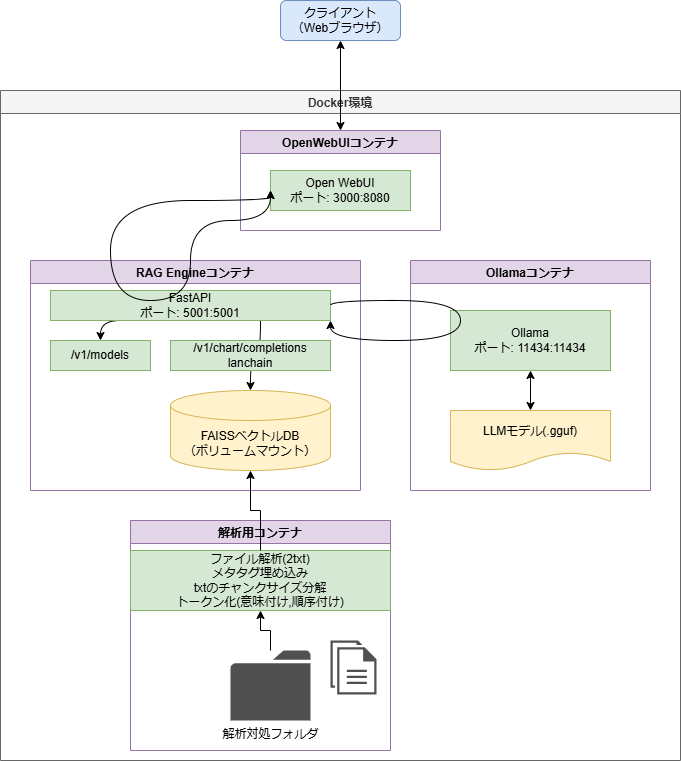

# my-llm-project

このプロジェクトは、ローカル環境で動作するLLM（大規模言語モデル）のチャットアプリケーションと、RAG（Retrieval Augmented Generation：検索拡張生成）機能を組み合わせたシステムです。

## 概要

本システムは以下の3つのコンポーネントで構成されています。すべてDocker上で動作するため、ホストPC環境を汚さずに構築可能です。

1. **Ollama**: ローカルLLMサーバー（モデル：`Nemotron-Nano-9B-v2-Japanese`）
2. **Open WebUI**: ChatGPTライクな高機能Webインターフェース
3. **RAG Engine**: 独自の文書をベクトルデータベース（FAISS）から検索し、LLMに回答させるFastAPIサーバー

---

## ⚠️ 初回構築時の重要なお知らせ（必ずお読みください）

このシステムはローカルでAIを動かす性質上、**初回のセットアップに非常に時間がかかります。**
途中で止まっているように見えても、裏でダウンロードやコピーが進行していることが多いため、気長にお待ちください。

* **モデルファイルのダウンロード（約5.5GB）**: 回線速度に依存しますが、数十分かかる場合があります。
* **RAGエンジンの初回ビルド（約3~5GB）**: PyTorchやCUDAなどの巨大なライブラリをダウンロード・インストールするため、**10分〜30分程度**かかります（PCスペックと回線に依存）。
* **AIモデルのDocker内への展開（最長1時間）**: Docker for Windowsの仕様上、Windows側のフォルダにある5.5GBのモデルファイルをDocker内部の専用領域にコピーする処理が行われます。この処理中はチャットが応答しません。**進捗は `docker logs ollama-gpu -f` コマンドで確認でき、100%になるまで数十分〜1時間ほどお待ちいただく必要があります。（初回のみ）**

---

## 💻 前提条件（必須環境）

このシステムを動かすには、以下のソフトウェアとハードウェアが必要です。

* **OS**: Windows (WSL2環境推奨), macOS, Linux
* **GPU**: NVIDIA GPU (VRAM 6GB以上を強く推奨)
* **ソフトウェア**:
  * [Docker Desktop](https://www.docker.com/products/docker-desktop) または Docker Engine がインストールされ、起動していること
  * Dockerの `NVIDIA Container Toolkit` が設定済みであること（GPUを使用する場合）
  * `git` コマンドが使用可能なこと

---

## 🚀 セットアップ手順（初心者向け完全ガイド）

### Step 1: リポジトリのクローンと移動

ターミナル（Windowsの場合はPowerShellやコマンドプロンプト）を開き、以下のコマンドを実行します。

```bash
# プロジェクトをダウンロード
git clone <このリポジトリのURL>
# フォルダへ移動
cd my-llm-project
```

### Step 2: LLMモデルファイルのダウンロードと配置

AIの「脳」となるモデルファイル（約5.5GB）を手動でダウンロードします。

1. 以下のリンクからモデルファイル（`.gguf`形式）をダウンロードします。
   ▶ [NVIDIA-Nemotron-Nano-9B-v2-Japanese-Q4_K_M.gguf をダウンロード](https://huggingface.co/mmnga/Nemotron-Nano-9B-v2-Japanese-gguf/resolve/main/NVIDIA-Nemotron-Nano-9B-v2-Japanese-Q4_K_M.gguf)
2. ダウンロードしたファイルを、このプロジェクト内の `ollama/models/` フォルダの中に移動させます。

> **完了確認**: `my-llm-project/ollama/models/NVIDIA-Nemotron-Nano-9B-v2-Japanese-Q4_K_M.gguf` という配置になっていればOKです。

### Step 3: Dockerサービスの起動

すべての準備が整ったら、システムを起動します。

```bash
docker-compose up -d --build
```

**【重要】このコマンドを実行した後の待ち時間について**
* コマンド実行直後から、RAGエンジンの環境構築（PyTorchなどの巨大なファイルのダウンロード）が始まります。
* **ターミナルの文字の動きが止まっても、エラーが出ていなければ（赤字等で止まらなければ）そのまま10〜30分ほど放置してください。**
* `Container open-webui Started` のようなメッセージが出れば起動完了です。

### Step 4: アプリケーションへのアクセス

ブラウザを開き、以下のURLにアクセスしてください。

▶ **[http://localhost:3000](http://localhost:3000)**

* 初回アクセス時に、管理者のアカウント作成（サインアップ）画面が表示される場合があります。お好きなメールアドレスとパスワードで登録してください（ローカル環境なので外部には送信されません）。
* 画面上部のモデル選択で `my-nemotron-model` を選択し、チャットを開始できます。

---

## 🛠 トラブルシューティング（よくあるエラーと解決法）

### Q1. `$'\r': command not found` または `exec /entrypoint.sh: no such file or directory` というエラーが出てOllamaが起動しない（Windowsの方）

**原因**: WindowsでGitクローンした際、ファイルの改行コードが「CRLF」に変換されてしまい、LinuxベースのDockerコンテナがスクリプトを実行できなくなっているためです。
**解決法**: `ollama/entrypoint.sh` ファイルをVSCodeなどのエディタで開き、右下の改行コードを「CRLF」から「LF」に変更して上書き保存してください。その後、`docker-compose up -d --build` を再度実行します。
（※現在はこの問題を自動で防ぐための `.gitattributes` ファイルを追加済みです）

### Q2.ポートが既に使用されている（`port is already allocated`）と言われる

**原因**: 過去に起動した別のDockerコンテナ（Difyなど）が同じポート（3000 や 5001）を使用しているためです。
**解決法**: ポートを使用しているコンテナを停止してください。
```bash
# 稼働中のコンテナ一覧を確認
docker ps
# 該当のコンテナを停止（例：dify-webというコンテナの場合）
docker stop dify-web
# 当システムを再起動
docker-compose up -d
```

### Q3. チャット画面は開けるが、いつまで待ってもAIが返答しない（考え中から進まない）

**原因**: 初回構築時、5.5GBの巨大なAIモデルをWindows側からDockerの内部ストレージ（Volume）へコピーする作業が裏で進行中です。このコピーが完了するまではAIは応答できません。
**解決法**: 別のターミナル（PowerShell等）を開き、以下のいずれかのコマンドを実行して状況を確認してください。

**① 進捗をリアルタイムで見守る場合**:
```bash
docker logs ollama-gpu -f
```
`copying file sha256:... 15%` のようなログが流れていれば正常です。これが `100%` になり `Model created successfully!` と表示されるまで放置してください（PCスペックにより30分〜1時間かかります）。

**② コピーが完了したか一瞬で確認する場合**:
```bash
docker exec ollama-gpu ollama list
```
実行結果に `my-nemotron-model:latest` と表示されれば、コピー処理は完全に終わっておりAIの準備は完了しています。（何も表示されない場合はまだ裏で処理中です）

### Q4. 「モデルが見つかりません」またはAIが返答しない（上記Q3ではない場合）

**原因**: ステップ2のモデルファイル配置場所が間違っているか、ファイル名が完全に一致していない可能性があります。
**解決法**: `ollama/models/` の中に `NVIDIA-Nemotron-Nano-9B-v2-Japanese-Q4_K_M.gguf` という名前でファイルが保存されているか、拡張子が `.gguf.txt` などになっていないか確認してください。

### Q5. 起動時に `llama runner process has terminated: exit status 2` とエラーが出てOllamaがクラッシュする

**原因**: `Nemotron-Nano-9B-v2` が採用している最新のハイブリッドアーキテクチャ（`nemotron_h`）に起因する問題です。このアーキテクチャはOllamaの最新版（`0.14`以降等の内部 `llama.cpp` エンジン）で読み込むと、浮動小数点例外（SIGFPE）を引き起こす既知のバグ（リグレッション）が存在します。
**解決法**: このバグを回避するため、本プロジェクトでは意図的に**Nemotronモデルが安定して動作する最後のバージョンである `ollama:0.13.3` にバージョンを固定（ピン留め）**しています。ご自身で `ollama/Dockerfile` のバージョンを `latest` などに書き換えるとクラッシュしますので、当面の間はダウングレードされた `0.13.3` のままご利用ください。

---

## 🧠 RAG機能について

RAG Engineは、FAISSベクトルデータベースを使用して効率的な検索を行います。

* 日本語の検索クエリに対応（`multilingual-e5-large` 埋め込みモデル使用）
* メタデータによるフィルタリング機能
* サンプルのナレッジ（`faiss_data` フォルダ）には、育児休暇やフレックスなどの仮の社内規則データが入力されています。

システム構成図は以下の通りです。



---

## 💡 TIPS: RAG用データベース（社内知識）の更新方法

ご自身のドキュメントや社内規則をAIに読み込ませたい場合は、以下の手順でベクトルデータベースを更新します。

1. **ドキュメントの配置**
   プロジェクト内の `docs/` フォルダの中に、読み込ませたいテキストファイル（`.txt`, `.md`, `.csv`）を配置してください。
2. **データベース作成ツールの実行**
   起動中の `rag-engine` コンテナ内で、専用の更新スクリプトを実行します。
   ```bash
   # 別のターミナルを開き、以下のコマンドを実行
   docker exec rag-engine python create_db.py
   ```
   ※実行するたびに、その時点で `docs/` フォルダに入っているファイルだけを使って**データベースが完全に上書き（洗い替え）されます**。過去に読み込ませたファイルでも `docs/` から消して実行するとDBからも消去されるため管理が簡単です。
   ※処理完了時に `✅ データベースの更新が正常に完了しました！` と表示されれば成功です。
3. **RAGシステムの再起動**
   データベースの更新内容をAIに反映させるため、RAGエンジンを再起動します。
   ```bash
   docker restart rag-engine
   ```
   再起動後、新しく追加した知識をベースにAIが回答するようになります。

---

## 💡 TIPS: 別のLLMモデルに変更する方法

使用するAIモデル（`.gguf` ファイル）を変更したい場合は、以下の手順で設定を変更できます。

1. **新しいモデルの配置**
   使いたいモデルファイル（例：`new-model.gguf`）をダウンロードし、`ollama/models/` フォルダの中に配置します。
2. **Modelfile の書き換え**
   `ollama/Modelfile` をテキストエディタで開き、1行目のファイル名を変更します。
   *変更前*: `FROM /import_models/NVIDIA-Nemotron-Nano-9B-v2-Japanese-Q4_K_M.gguf`
   *変更後*: `FROM /import_models/new-model.gguf`
   （※モデルに合わせて `TEMPLATE` や `SYSTEM` プロンプトも書き換えるとより精度が上がります）
3. **entrypoint.sh の変更（任意）**
   必要であれば `ollama/entrypoint.sh` 内のモデル名（`my-nemotron-model` の部分）を任意の名前に変更します。
   * 例: `ollama create new-model-name -f /Modelfile`
4. **Dockerfile の Ollama バージョン確認**
   本プロジェクトでは `NVIDIA-Nemotron-Nano-9B-v2` モデルのクラッシュバグ（`Q5`参照）を回避するため、`ollama/Dockerfile` のベースイメージを意図的に古い `ollama/ollama:0.13.3` に固定しています。
   もし別のモデルに変更して上手く動かない場合や、最新のOllamaの新機能を使いたい場合は、`FROM ollama/ollama:latest` に戻してから再ビルドしてください。
5. **コンテナの再ビルド**
   設定を変更したら、一度Ollamaコンテナを削除して再ビルドします。
   ```bash
   # Ollamaコンテナの停止と削除
   docker stop ollama-gpu
   docker rm ollama-gpu
   # 再ビルドと起動
   docker-compose up -d --build ollama
   ```
   ※変更後は再度「Docker内へのモデル展開（コピー処理）」が行われるため、Q3の通り待ち時間が発生します。
